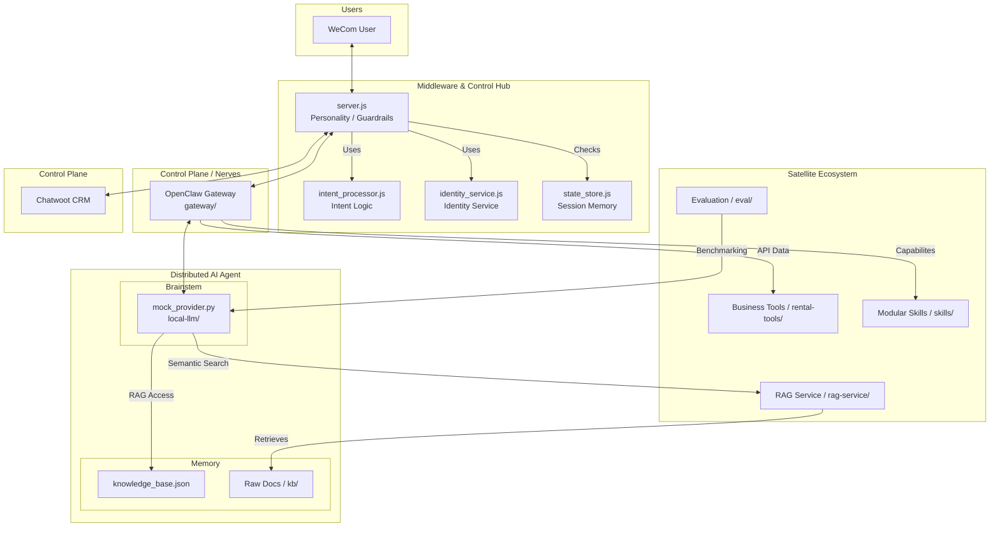

# 🏗️ Tongye AI CRM: Comprehensive Architecture Blueprint (V3.0)

## 1. Interaction Topology

The system operates as a **Triangular Interaction Model**:
1.  **User Interface**: Enterprise WeChat (WeCom).
2.  **Logic Hub**: WeCom Bridge (Node.js Middleware).
3.  **Human/AI Control Plane**: Chatwoot CRM + OpenClaw AI.

## 2. Core Functional Workflows

### 2.1 Incoming Message (The Processing Pipe)
1.  **Ingress**: `POST /wechat` (Signed & Encrypted).
2.  **Verification**: `wecom_crypto.js` verifies the signature.
3.  **Identity Resolution**: `identity_service.js` converts WeCom ID to `ty_uid`.
    *   *Side Effect*: Contact data synced to Chatwoot with `U-XXXXXX` Handle prefix.
4.  **Intent Classification**: `intent_processor.js` detects user goal.
5.  **State Check**: `state_store.js` checks if the session is locked in `HUMAN_MODE`.
6.  **AI Invocation**: `openclaw_client.js` calls the LLM.
    *   *Constraint*: High-risk actions (Refunds/Cancellations) are blocked and result in a "Transfer to Human" template.
7.  **Response Egress**: AI response is encrypted and sent back to WeCom.

### 2.2 Human Intervention (Escalation)
1.  **Detection**: Keywords ("Human", "Service", "Complaint") trigger `HUMAN_MODE`.
2.  **Mode Switch**: `state_store.js` updates SQLite. 
3.  **Bridge Silence**: Once in `HUMAN_MODE`, AI responses are diverted to Chatwoot as **Private Notes** only, not sent to the end-user.
4.  **Human Reply**: CSR replies in Chatwoot UI -> Webhook to Bridge -> `wecom_client.js` pushes to User.

## 3. High-Integrity Guards
*   **Version Latching**: `REQUIRED_SCHEMA_VERSION = '2.1.0'`. If the database isn't compatible, the service crashes immediately to prevent data corruption.
*   **Loop Protection**: `outbound_dedup` table tracks messages originating from the Bridge itself to avoid infinitely re-processing outbound human replies.
*   **Privacy Guard**: User metadata is stored in Postgres, but Chatwoot only sees the `handle` and name, keeping the full identity audit trail within the private `ty_identity` system.

## 4. Port & Network Matrix
| Component | Port | Internal URL | Protocol |
| :--- | :--- | :--- | :--- |
| WeCom Bridge | 3001 | `http://localhost:3001` | Express / HTTP |
| Chatwoot | 3000 -> 3005 | `http://localhost:3005` | Rails / HTTP |
| Mock LLM | 8000 | `http://localhost:8000` | Python / Flask |
| OpenClaw | 18789 | `http://localhost:18789` | Go / OpenClaw |
