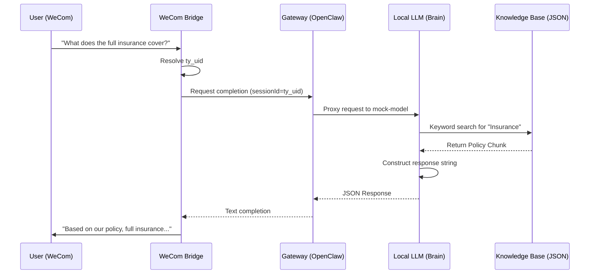
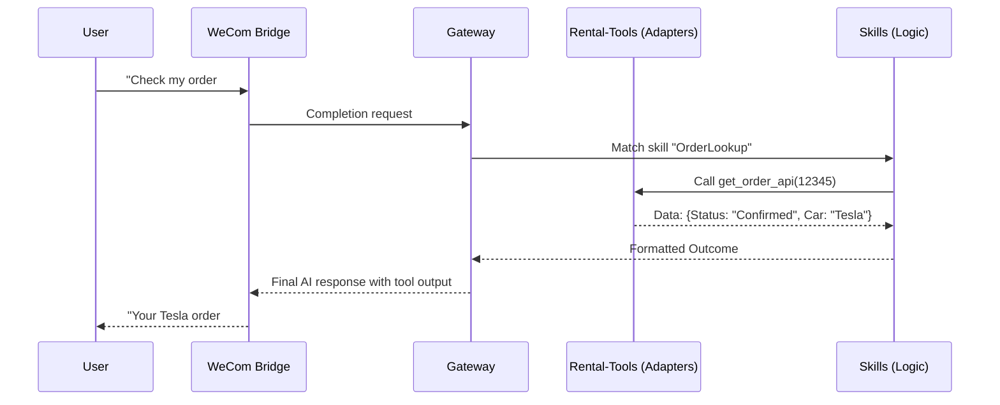
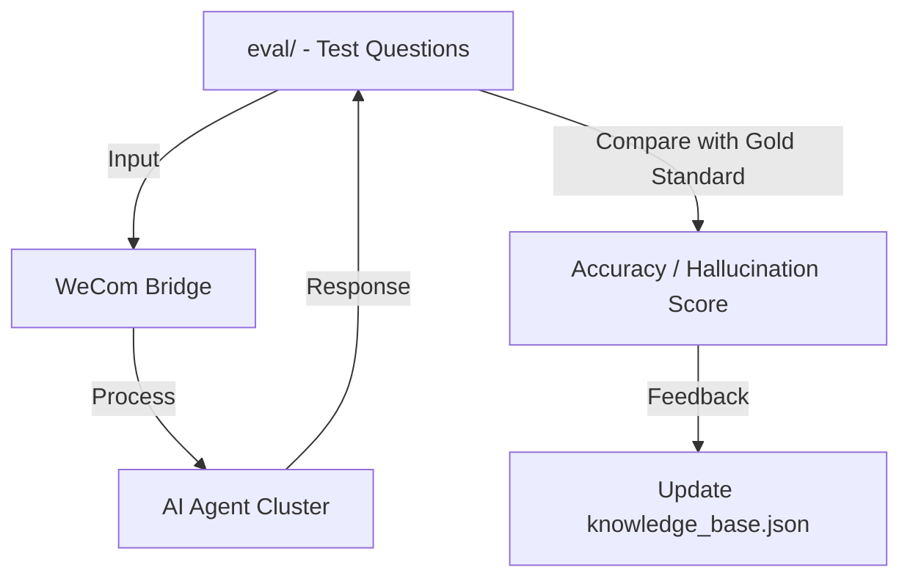

# 📉 Tongye AI CRM: Cross-Module Data Flow & Interactions (V3.0)

This document visualizes how the seven subsystems interact with the Bridge hub to form a cohesive Smart Agent.

## 1. The RAG Knowledge Loop
How a user's question about "Insurance" is processed.

## 2. Intended Tool/Skills Loop
How the system is designed to handle "Order Status" (Planned).

## 3. The Quality Control Loop (Evaluation)
How the developers ensure the system stays accurate.

## 4. Module Resource Responsibility Matrix

| Module | Filesystem Owner | Process Runtime | Shared Security Data |
| :--- | :--- | :--- | :--- |
| **Bridge** | `wecom-bridge/` | Node.js (3001) | `.env.profile` |
| **Brain** | `local-llm/` | Python/Flask (8000) | `knowledge_base.json` |
| **Router** | `gateway/` | OpenClaw (18789) | `openclaw.json` |
| **Logic** | `skills/` | N/A (Static Logic) | N/A |
| **Data** | `kb/` | N/A (Source Files) | Metadata Tags |
