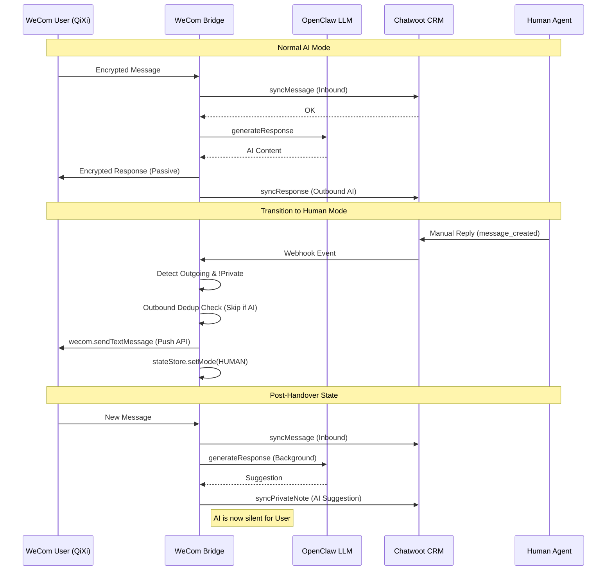

# System Architecture v2.0.0 (Unified Hybrid Service)

## 1. Interaction Flow Diagram

## 2. Engineering Standards (V2)

### 2.1 Identity Persistence
- **Rule**: Never use `msgId` for mapping.
- **Implementation**: The `fromUser` (UserID) must be used as the `identifier` in Chatwoot Contacts and the `source_id` in Conversations.

### 2.2 Loop Prevention (Governance)
- **Problem**: Chatwoot Webhooks trigger on ALL messages, including those synced BY the Bridge.
- **Solution**: 
  1. Bridge captures the `message_id` from Chatwoot after successful `syncMessage`/`syncResponse`.
  2. Bridge stores this ID in a SQLite table `outbound_dedup`.
  3. Webhook handler queries `outbound_dedup` before acting.

### 2.3 Network Reliability
- **Standard**: Always use Docker Bridge Gateway (`172.17.0.1`) for cross-container communication to bypass Nginx `proxy_set_header` conflicts and Hairpin NAT issues.

### 2.4 Mode Logic
- **AI_MODE**: Bridge passively replies to WeCom XML requests.
- **HUMAN_MODE**: Bridge returns `success` to WeCom immediately (silent) and puts the RAG output into Chatwoot `private_note`.
