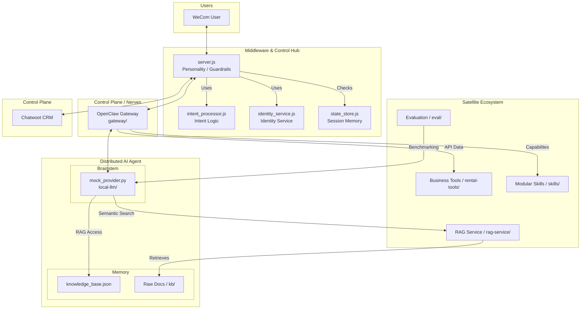

# System Architecture V3.0.0 (Distributed Intelligence Hub)

## 1. Interaction Topology (The Seven-Satellite Model)

The "Agent" is a distributed entity across the following components:
*   **Brain**: `local-llm/mock_provider.py` (Reasoning).
*   **Logic**: `intent_processor.js` (Perception/Intent).
*   **Memory**: `knowledge_base.json` (Knowledge context).
*   **Personality/Guards**: `server.js` (Business safety/Mode switching).

## 2. Core Operational Logic

### 2.1 The "Bootstrap" Safety (Self-Checking)
Before serving requests, the system executes `bootstrapCheck()`:
*   Checks for `PROFILE` (e.g., `prod_cn_vpn`).
*   Verifies `ty_identity` (Postgres) schema version is EXACTLY `2.1.0`.
*   Verifies local SQLite health.
*   **Exit Code 1** if any check fails to prevent architectural drift.

### 2.2 Intent-Based Routing
The `intent_processor.js` handles multi-tier distribution:
*   **INTENT_TRANSFER**: Direct switch to `HUMAN_MODE`.
*   **INTENT_ORDER**: Triggers business logic check (e.g., blockage of sensitive operations).
*   **INTENT_FAQ**: Routes to RAG (Local LLM).

### 2.3 Identity Sovereign (ty_uid)
*   **Persistence**: Users are mapped to `ty_uid` via `identities` table.
*   **Display**: Chatwoot contacts are forced to use `Handle | Nickname` formatting for visual consistency.
*   **Source ID**: All CRM objects are prefixed with `ty:` (e.g., `ty:TYU_123`).

## 3. Storage Definitions (High Integrity)

### A. Global Identity (ty_identity - Postgres)
| Table | Scope | Role |
| :--- | :--- | :--- |
| `system_meta` | Architecture | **Master Version Lock** |
| `users` | Management | Core `ty_uid` and `handle` storage |
| `identities` | Channel | Mapping external keys to `ty_uid` |
| `chatwoot_links` | Integration | Cache for CRM mapping |

### B. Local Cache (wecom_bridge.db - SQLite)
| Table | Scope | Role |
| :--- | :--- | :--- |
| `conversation_state` | Session | `AI_MODE` / `HUMAN_MODE` lock |
| `msg_dedup` | Resilience | 100% Idempotency guard |
| `audit_log` | Forensic | Q&A audit trail |

## 4. Execution Governance
*   **Zero Leakage**: AI suggestions are synced as `private_note` in Chatwoot when in `HUMAN_MODE`.
*   **Loop Guard**: `outbound_dedup` prevents the Bridge from re-processing its own synced messages from Chatwoot Webhooks.
*   **Fallback Strategy**: If AI fails, the system auto-degrades to `HUMAN_MODE` and alerts the agent via Chatwoot note.
