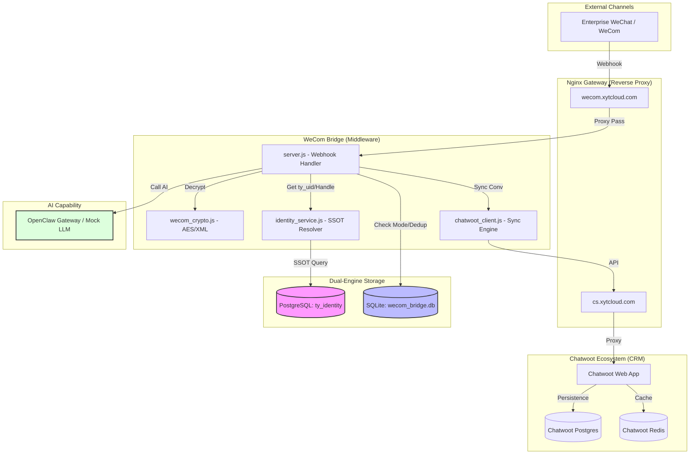

# System Architecture Specification

## 1. Overview
The WeCom Bridge acts as a robust middleware connecting Enterprise WeChat (WeCom) with the Chatwoot CRM, integrated with an AI-driven automation layer (OpenClaw).

## 2. Dual-Database Architecture
The system employs a "Dual-Engine" storage strategy to balance global persistence with local performance.

| Component | Database | Scope | Purpose |
| :--- | :--- | :--- | :--- |
| **Canonical Identity** | **PostgreSQL** (`ty_identity`) | Global / Persistent | Platform-agnostic identity mapping (`ty_uid`), user profiles, and audit logs. |
| **Service State** | **SQLite** (`wecom_bridge.db`) | Local / Volatile-ish | High-frequency session mode (`AI` vs `HUMAN`), message deduplication, and ephemeral metrics. |

### Why this architecture?
- **Decoupling**: Global identity is shared across the Tongye ecosystem, while state is private to the Bridge instance.
- **Performance**: SQLite provides sub-millisecond local reads for de-duplication and state checks without network overhead.
- **Reliability**: If the global DB is temporarily unreachable, the Bridge can still maintain local state (though identity resolution may fall back to cached values).

## 3. System Architecture Diagram

## 4. Lifecycle of a Message (Governance Standard)
1.  **Reception**: Secured by WeCom signature verification via `wecom_crypto`.
2.  **Identity Resolution**: `FromUserName` is mapped to a canonical `ty_uid` and `U-XXXXXX` handle via `ty_identity` (Postgres).
3.  **Local State Check**: Session mode (`AI` vs `HUMAN`) and message deduplication performed via `wecom_bridge.db` (SQLite).
4.  **Governance & Intent**: Intent classification (FAQ, Transfer, Order) determines the processing path.
5.  **Synchronization**: The message is synced to Chatwoot using the `ty:ty_uid` identifier, creating/linking a contact.
6.  **AI Orchestration**: If in `AI_MODE`, the request is sent to OpenClaw; response is synced to CRM.
7.  **Dispatch**: Response delivered back to the user via WeCom's passive reply or push API.

## 5. 《反漂移与架构固化原则》（Highest Engineering Constraint）

为确保系统在快速演进过程中不发生“架构腐化”或“功能漂移”，本中心制定以下最高工程约束。后续任何代码合并（PR）必须通过这些原则的静态与动态校验。

### 5.1 身份主权不可动摇
- **唯一真相源 (SSOT)**：所有用户身份（`ty_uid`）、角色属性（`actor_type`）和全局编号（`handle`）的主权仅存在于 **PostgreSQL (`ty_identity`)** 数据库中。
- **UI 层隔离**：Chatwoot 仅作为 CRM 展示层（UI Layer）。系统**严禁**参考 Chatwoot 内部 ID 进行任何业务逻辑判定，亦不得将 Chatwoot 视为身份记录器。所有同步至 Chatwoot 的 `source_id` 必须强制遵循 `ty:${ty_uid}` 格式。

### 5.2 启动熔断机制
- **Schema 强对齐**：系统在启动时必须自动执行 `Bootstrap Check`。若读取到的 `system_meta.schema_version`（Postgres）与代码中预置的 `REQUIRED_SCHEMA_VERSION` 不一致，进程必须**立即终止 (FATAL EXIT)**。
- **禁止静默升级**：任何涉及数据库结构的变更必须通过手动/受控的迁移工具执行，严禁通过业务代码在运行时进行静默、自动的库结构修改。

### 5.3 运行环境 Profile 唯一性
- **零硬编码**：业务代码中严禁出现任何硬编码的域名（如 `xytcloud.com`）。
- **环境隔离**：所有网络接入（CN 直连、VPN 代理、全球加速）的差异必须通过 `config/profiles/*.env` 进行映射。
- **PROFILE 守卫**：启动时未指定 `PROFILE` 环境变量，或指定的 Profile 文件缺失时，系统严禁启动。

### 5.4 治理测试不变量
- **自动化红线**：`test/governance.test.js` 定义了身份不变量的物理红线。任何导致测试失败的改动（例如破坏了 `ty_uid` 的恒定性）均视为架构漂移，严禁合并至主分支。
